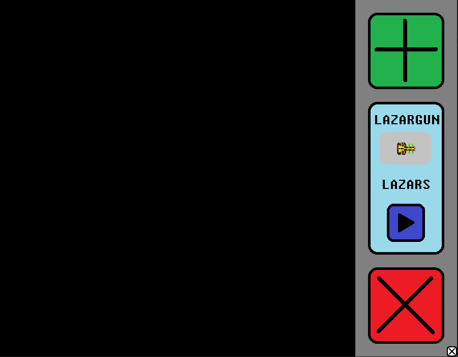

# Lazar Game

After making my first game, [Zombie Game](https://github.com/WhyPine/Zombie-Game), with C++ using SFML with the help of some friends a few months ago, I wanted to use what I learned and challenge myself to make a game alone. Each time I worked on this project, I went in with a small goal for the day. This helped immensely because the reflection code was pretty daunting, but I managed to figure it out step by step. Also, making small goals each day made it always feel good to work on this project.

This game is intended to be a simple sandbox where you can play with lazar beams reflecting off walls. I came up with this idea while taking a summer physics for engineers class where I learned about how light reflects and refracts. I had an idea to make a game implementing both features and found that reflections are much more fun to play with (and easier) than refractions. My code is thoroughly commented so you can see my thought process on how things (are supposed to) work. Check out IDEA.txt to see my initial idea and compare it to how things ended up! :)

Download LAZARGAME.zip to play it yourself!

> Note: I used this to get started: https://github.com/rewrking/sfml-vscode-boilerplate

## Gameplay

### Check out this [Demo Video](https://youtu.be/mkPBiaYUGOY)

### About the game

- Click on the large green box to add as many walls as you want
- Drag and drop walls anywhere on the play area using the small blue circles
- Drag and drop walls onto the large red box to delete them
- Drag and drop the Lazar Gun at any time to any location
- Click on the smaller red circles after clicking on an object to rotate and/or resize
- Press the blue play button to begin shooting lazars from the lazar gun
- Press the blue pause button to stop shooting lazars and delete all lazars
- Press the small white X button on the bottom right to reset everything

## Features

### Completed

- Walls
  - Moving walls with movement object + texture
  - Rotating & Resizing walls with transformation object + texture
  - Selected walls are outlined in red
  - Walls will stay within play area bounds
  - If multiple walls are stacked, the wall that is visually on top will be selected when clicked on
- Wall adder
  - Click to spawn a new wall that can be dragged and dropped
  - Number of walls is only limited by performance - effectively infinite
- Wall deleter
  - Drag and drop walls onto the deleter to delete them
- Lazar beam
  - Lazar beam is a solid beam made up of multiple lazar objects
  - Individual lazars are deleted when moving off screen
  - Lazar gun object can be moved around and rotated
  - Lazars reflect off all sides of walls
  - Custom texture for the lazar beam
  - Note: reflections are calculated when lazars are shot and/or reflecting off surfaces so when moving walls they can act a bit weird
- Lazar Gun
  - The lazar gun spawns in the grey area under "Lazar Gun"
  - Always able to be moved and rotated
  - Custom texture
  - Always stays inside the screen bounds
- Pause/play button
  - Hit play tobegin shooting lazars
  - Hit pause to get rid of lazars
- Reset button
  - Hit the reset button on the bottom right to reset the game

### Known Issues

- Lazars sometimes phase through straight vertical/horizontal walls
